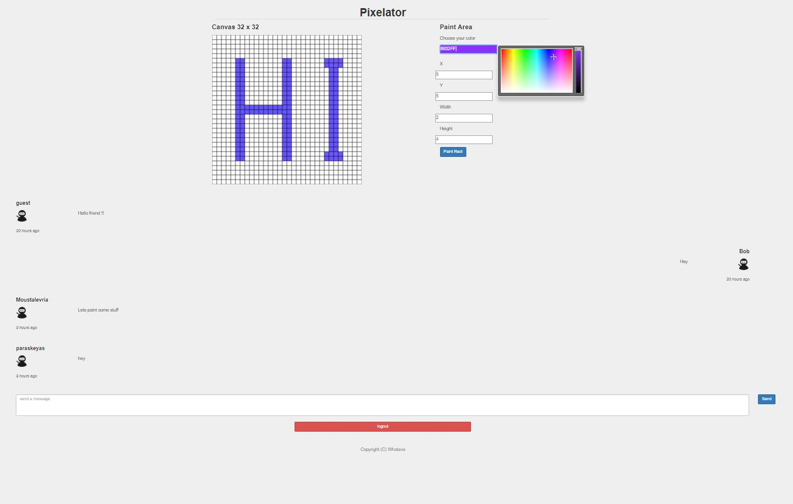

pixelator
============================

### A playground where users can fool around on a shared canvas.

\ ゜o゜)ノ

Expansion upon the final challenge(12) of the [Advanced node.js/express challenges repo](https://github.com/AngelKyriako/FccAdvancedNodejsExpressApp) 

## Expansion Details

### Server Routes
- GET  /api/globalcanvas
- POST /api/globalcanvas/paint

### Server View
- views/globalCanvas.pug

### Client 
- Top screen section
  - Canvas
  - Color picker

## Screenshot

